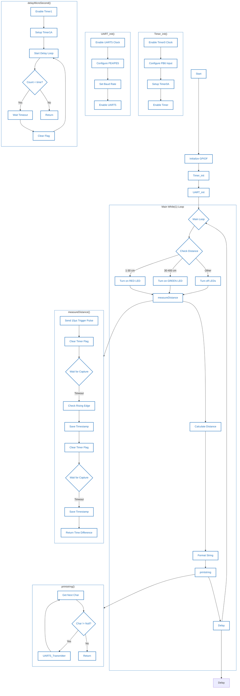
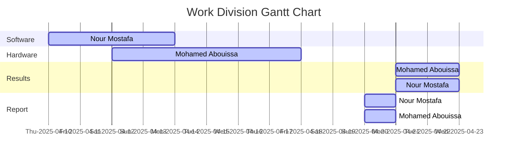

<p align="center">
  
</p>

This report is Markdown-typed and was submitted in Spring 2025 by students [Nour Mostafa](https://github.com/Nour-MK) with ID 2021004938 and [Mohamed Abouissa](https://github.com/Mohamed-Abouissa) with ID 2021005188 in partial fulfillment of the requirements for the Bachelor of Science degree in Computer Engineering. We extend our sincere appreciation to Eng. Umar Adeel for his insightful feedback, which has significantly contributed to the successful completion of this experiment.

---

This project is a real-time proximity-based security system built using the Tiva C Series [TM4C123GH6PM microcontroller](Photos/TM4C123GXL.png), designed to detect the presence of intruders and trigger an immediate deterrent response. At its core, the system utilizes the HC-SR04 ultrasonic sensor to measure the distance between itself and any approaching object with high precision. When an object is detected within a critical threshold—specifically, 10 centimeters—the system activates a defensive mechanism by energizing a connected taser circuit. This high-voltage output is delivered via the same GPIO pin that also drives a red LED indicator, serving as both a warning signal and the trigger interface for the electrocution circuit. The use of shared hardware lines in this way reflects a tightly integrated design where visual and functional feedback are synchronized to maximize both efficiency and system responsiveness.

The **HC-SR04** is a popular ultrasonic distance sensor widely used in embedded systems and robotics for non-contact distance measurement. It operates by emitting high-frequency sound waves at 40 kHz through its transmitter, then measuring the time it takes for the echo to reflect off an object and return to the receiver. The sensor has four pins: VCC (power), GND (ground), Trig (trigger input), and Echo (echo output). To initiate a reading, a 10-microsecond pulse is sent to the Trig pin, prompting the sensor to emit a burst of ultrasonic waves. When these waves bounce back from an object, the Echo pin stays high for the duration it takes for the echo to return. By measuring this time and applying the speed of sound (34300 cm/s), the distance to the object can be calculated using the formula: Distance = (Time × Speed of Sound) / 2. The division by two accounts for the round-trip journey of the sound wave. The HC-SR04 is capable of detecting objects from approximately 2 cm to 400 cm away, with an accuracy of about ±3 mm and a sensing angle of 15 degrees. It requires a 5V power supply and draws around 15mA of current. This sensor is commonly used in applications such as obstacle detection, automation systems, smart parking setups, and proximity-based security systems like the one in this project, where it helps trigger a response when someone enters a predefined danger zone.

This system is comprised of two main components: a [hardware component](#hardware-component) and a [software component](#software-component), each playing a vital role in the overall functionality of the project. The hardware component consists of the Tiva TM4C123 microcontroller, the HC-SR04 ultrasonic sensor, the custom taser circuit, and the on-board LEDs, which all work together to detect proximity and trigger the necessary reactions. The software component, on the other hand, encompasses the embedded code running on the microcontroller, responsible for managing sensor data, processing distance measurements, controlling the LEDs, and ultimately triggering the taser circuit based on predefined thresholds. This integration of both hardware and software is the essence of building an embedded system, where the seamless interaction between the physical components and the programmed logic enables real-world functionality. The system not only demonstrates the importance of these two components working in harmony but also highlights how embedded systems are designed to serve specific, real-time purposes by combining the tangible aspects of hardware with the responsive nature of software.

The apparatus essential for this project includes the TM4C123GH6PM microcontroller, the [HC-SR04 ultrasonic distance sensor](https://www.handsontec.com/dataspecs/HC-SR04-Ultrasonic.pdf), jumper wires, and a custom-built taser circuit containing ... all complemented by the Keil uVision 5 IDE.

## Software Component

The flowchart of our program serves as the foundational blueprint that guided our entire development process from start to finish. It visually maps out the logical sequence of operations our system follows, beginning from the initialization of peripherals and leading up to the core decision-making based on real-time distance measurements. This structured plan allowed us to break down the complexity of the system into manageable stages, such as triggering the sensor, capturing and processing the echo signal, evaluating the distance, and finally activating the corresponding response—whether lighting up an LED or triggering the taser circuit. By adhering to this flowchart, we ensured consistency and clarity, where each component could be built and tested in isolation before being integrated into the full system.




``` C
#include "TM4C123GH6PM.h"
#include "TM4C123.h"
#include <stdio.h>
#include <stdint.h>
/*Function prototype for Timer0A and UART module initialization */

uint32_t measureDistance(void);
void Timer_init(void);
void delayMicroSecond(int time);
void UART_init(void);
void UART5_Transmitter(unsigned char data);
void printstring(char *str);
void Delay(unsigned long counter);

/* global variables to store and display distance in cm */
uint32_t time; /*stores pulse on time */
uint32_t distance; /* stores measured distance value */
char mesg[20];  /* string format of distance value */

/* main code to take distance measurement and send data to UART terminal */
int main(void)
{
SYSCTL->RCGCGPIO |=0x20;
GPIOF->LOCK = 0x4C4F434B;
GPIOF->CR = 0x1F;
GPIOF->DEN = 0x1F;
GPIOF->DIR = 0x0E;
	
Timer_init();  /*initialize Timer0A in edge edge time */
UART_init(); /* initialize UART5 module to transmit data to computer */
	while(1)
	{
		if (distance >= 1 && distance <= 30){
			GPIOF->DATA=0x02; // RED LED LIGHT UP
		}
		else if(distance >30 && distance <= 400){
			GPIOF->DATA=0x08; // GREEN LED LIGHT UP
		}
		else{GPIOF->DATA=0x00;}
		time = measureDistance(); /* take pulse duration measurement */ 
		distance = ((time * 10625)/10000000)-10; /* convert pulse duration into distance */
		sprintf(mesg, "\r\nDistance = %d cm", distance); /*convert float type distance data into string */
		printstring(mesg); /*transmit data to computer */
		Delay(1000);
	}
	
}

/* This function captures consecutive rising and falling edges of a periodic signal */
/* from Timer Block 0 Timer A and returns the time difference (the period of the signal). */
uint32_t measureDistance(void)
{
    int lastEdge, thisEdge;
	
	  /* Given 10us trigger pulse */
	  GPIOA->DATA &= ~(1<<4); /* make trigger  pin high */
	  delayMicroSecond(10); /*10 microseconds delay */
	  GPIOA->DATA |= (1<<4); /* make trigger  pin high */
	  delayMicroSecond(10); /*10 microseconds delay */
	  GPIOA->DATA &= ~(1<<4); /* make trigger  pin low */

 	while(1)
	{
    TIMER0->ICR = 4;            /* clear timer0A capture flag */
    while((TIMER0->RIS & 4) == 0) ;    /* wait till captured */
	  if(GPIOB->DATA & (1<<6)) /*check if rising edge occurs */
		{
    lastEdge = TIMER0->TAR;     /* save the timestamp */
		/* detect falling edge */
    TIMER0->ICR = 4;            /* clear timer0A capture flag */
    while((TIMER0->RIS & 4) == 0) ;    /* wait till captured */
    thisEdge = TIMER0->TAR;     /* save the timestamp */
		return (thisEdge - lastEdge); /* return the time difference */
		}
	}
}

/* Timer0A initialization function */
/* Initialize Timer0A in input-edge time mode with up-count mode */
void Timer_init(void)
{
    SYSCTL->RCGCTIMER |= 1;     /* enable clock to Timer Block 0 */
    SYSCTL->RCGCGPIO |= 2;      /* enable clock to PORTB */
    
    GPIOB->DIR &= ~0x40;        /* make PB6 an input pin */
    GPIOB->DEN |= 0x40;         /* make PB6 as digital pin */
    GPIOB->AFSEL |= 0x40;       /* use PB6 alternate function */
    GPIOB->PCTL &= ~0x0F000000;  /* configure PB6 for T0CCP0 */
    GPIOB->PCTL |= 0x07000000;
    
	  /* PB2 as a digital output signal to provide trigger signal */
	  SYSCTL->RCGCGPIO |= 1;      /* enable clock to PORTA */
	  GPIOA->DIR |=(1<<4);         /* set PB2 as a digial output pin */
	  GPIOA->DEN |=(1<<4);         /* make PB2 as digital pin */

    TIMER0->CTL &= ~1;          /* disable timer0A during setup */
    TIMER0->CFG = 4;            /* 16-bit timer mode */
    TIMER0->TAMR = 0x17;        /* up-count, edge-time, capture mode */
    TIMER0->CTL |=0x0C;        /* capture the rising edge */
    TIMER0->CTL |= (1<<0);           /* enable timer0A */
}


/* Create one microsecond second delay using Timer block 1 and sub timer A */

void delayMicroSecond(int time)
{
    int i;
    SYSCTL->RCGCTIMER |= 2;     /* enable clock to Timer Block 1 */
    TIMER1->CTL = 0;            /* disable Timer before initialization */
    TIMER1->CFG = 0x04;         /* 16-bit option */ 
    TIMER1->TAMR = 0x02;        /* periodic mode and down-counter */
    TIMER1->TAILR = 16 - 1;     /* TimerA interval load value reg */
    TIMER1->ICR = 0x1;          /* clear the TimerA timeout flag */
    TIMER1->CTL |= 0x01;        /* enable Timer A after initialization */

    for(i = 0; i < time; i++)
    {
        while ((TIMER1->RIS & 0x1) == 0) ;      /* wait for TimerA timeout flag */
        TIMER1->ICR = 0x1;      /* clear the TimerA timeout flag */
    }
}
void UART_init(void)
{
	  SYSCTL->RCGCUART |= 0x20;  /* enable clock to UART5 */
    SYSCTL->RCGCGPIO |= 0x10;  /* enable clock to PORTE for PE4/Rx and RE5/Tx */
    /* UART0 initialization */
    UART5->CTL = 0;         /* UART5 module disbable */
    UART5->IBRD = 104;      /* for 9600 baud rate, integer = 104 */
    UART5->FBRD = 11;       /* for 9600 baud rate, fractional = 11*/
    UART5->CC = 0;          //select system clock/
    UART5->LCRH = 0x60;     /* data lenght 8-bit, not parity bit, no FIFO */
    UART5->CTL = 0x301;     /* Enable UART5 module, Rx and Tx */

    /* UART5 TX5 and RX5 use PE4 and PE5. Configure them digital and enable alternate function */
    GPIOE->DEN = 0x30;      /* set PE4 and PE5 as digital */
    GPIOE->AFSEL = 0x30;    /* Use PE4,PE5 alternate function */
    GPIOE->AMSEL = 0;    /* Turn off analg function*/
    GPIOE->PCTL = 0x00110000;     /* configure PE4 and PE5 for UART */
}
void UART5_Transmitter(unsigned char data)  
{
    while((UART5->FR & (1<<5)) != 0); /* wait until Tx buffer not full */
    UART5->DR = data;                  /* before giving it another byte */
}

void printstring(char *str)
{
  while(*str)
	{
		UART5_Transmitter(*(str++));
	}
}
void Delay(unsigned long counter)
{
	unsigned long i = 0;
	
	for(i=0; i< counter*1000; i++);
}
```


This program is designed to measure the distance to an object using an ultrasonic sensor, and then reflect that distance through UART serial output and LEDs on Port F. At a high level, the application operates by sending a trigger pulse to the ultrasonic sensor, capturing the duration of the returning echo pulse using a timer in edge-time capture mode, computing the distance based on the time of flight, and then displaying that result both visually using onboard LEDs and via a UART terminal. The code starts by enabling the required peripheral clocks for GPIO Port F, unlocking its control register using a special key (`0x4C4F434B`), and then configuring the direction and digital enable registers to make PF1, PF2, and PF3 outputs (for the LEDs), and PF0 and PF4 as inputs (though only the outputs are used in this case). This interaction with the GPIO peripheral involves the microcontroller's internal AHB bus, where the `RCGCGPIO` register in the system control block controls power gating for each port. Once clocking is established and the port is unlocked and configured, the microcontroller can now drive the RGB LEDs by writing directly to the GPIOF data register, effectively toggling voltage levels on those pins to switch the LEDs on or off.

The `main()` function then initializes Timer0A for input capture, and UART5 for serial communication. The UART initialization involves enabling its clock and configuring the alternate function of Port E pins (PE4 and PE5) to serve as the RX and TX lines, using the PCTL register to select the UART peripheral on those pins. UART is set up with a baud rate of 9600 by dividing the system clock and setting both the integer and fractional parts of the divisor, a process which configures the UART's internal baud rate generator. The UART control logic also enables both the transmitter and receiver circuitry and defines the data format (8-bit, no parity, and no FIFO buffering in this case). The microcontroller's UART module directly manages the low-level serial line transitions, asserting voltage changes on the TX line according to UART protocol timing, which are then interpreted by a connected PC or USB-to-serial adapter.

The `Timer_init()` function is crucial for enabling precise distance measurement. It sets up Timer0A in edge-time mode, a specialized mode in which the timer counts continuously and captures the timer value on rising or falling edges detected on an input pin. PB6 is configured for alternate function (T0CCP0), and the PCTL register is used to route the Timer peripheral's capture/compare channel to this pin. The timer itself is configured in 16-bit mode using the `CFG` register, and its mode is set to capture edge-time on both rising and falling edges through the `TAMR` configuration. The `CTL` register is then used to enable capture and start the timer. This setup allows the timer to precisely record timestamps of events on PB6, which corresponds to the Echo signal from the ultrasonic sensor. These low-level configurations directly interface with the microcontroller’s event capture logic, which routes input pin transitions to internal timer events through digital multiplexers.

The `measureDistance()` function is where the core measurement takes place. A trigger pulse of 10 microseconds is sent through PA4, which was previously configured as a digital output. This pin is manually toggled high, delayed for 10 microseconds using a microsecond delay function that relies on Timer1, and then toggled low again. This simulates the precise timing pulse needed to activate the ultrasonic sensor. Timer1 in the delay function is also configured in 16-bit down-count periodic mode, where the load register is filled with a value that causes it to count down from 16 (assuming a 16 MHz system clock) to 0, generating a 1-microsecond tick per iteration. When the echo returns to PB6, Timer0 captures the rising edge timestamp and waits again for the falling edge to record the second timestamp. The difference between these timestamps, taken from the TAR (Timer A Value) register, gives the time duration for which the echo signal was high, representing the time it took for the sound to travel to the object and back.

After capturing the pulse duration, the main loop uses this raw timer value to compute the distance. The formula used converts clock ticks into centimeters. Assuming the timer ticks at 16 MHz (so each tick is 62.5 nanoseconds), the expression `(time * 10625) / 10000000` effectively converts the raw duration into a distance in centimeters based on the speed of sound in air (343 m/s). An offset of -10 is subtracted, likely to account for sensor-specific delay or fixed minimum pulse width. The calculated distance is stored in a global variable and also formatted into a human-readable string using `sprintf`. This string is then transmitted over UART5 by sending each character one by one using `UART5_Transmitter()`. This function waits for the UART transmit FIFO to have space before writing the data into the data register, ensuring smooth transmission without loss of bytes.

Meanwhile, based on the value of the `distance`, the program also controls the LEDs on Port F. If the distance is between 1 and 30 cm, the red LED (PF1) is lit. If the distance is between 31 and 400 cm, the green LED (PF3) is lit. If the distance is outside this range, all LEDs are turned off. This simple conditional check manipulates the GPIOF data register to raise the corresponding pins high or low, directly sourcing or sinking current to the connected LEDs through internal digital output drivers. These hardware GPIO drivers are simple high-speed digital buffers that reflect the value of the `DATA` register onto the actual pins, allowing external components like LEDs to be driven directly from software.

Overall, the code showcases a tight integration between high-level C logic and low-level hardware control of the Tiva microcontroller. It manipulates clocks, timers, GPIOs, and UART modules directly through memory-mapped registers. The hardware responds by routing signals, triggering timers on edges, and driving I/O lines in accordance with the configurations. The program exemplifies how microcontrollers like the TM4C123GH6PM allow fine-grained control over peripherals, enabling precise real-time measurements and I/O coordination by writing to specific memory addresses that map directly to internal hardware logic blocks.


## Hardware Component

## Implementation Result


https://github.com/user-attachments/assets/2b14189e-10eb-48c0-99e7-bc0bd4fc48f6

The development approach for this project followed a bottom-up methodology, beginning with the simplest tasks and progressively increasing in complexity to achieve the final desired functionality. Initially, we focused on implementing the basic circuit, assuming there would be no taser circuit involved. For this, we utilized the on-chip red and green LEDs to signal whether an object was within 10 cm of the board. This served as a basic prototype to ensure the distance measurement functionality was working correctly. Once the custom taser circuit was finalized, the next step involved integrating the taser functionality by connecting its signaling pin to the same pin on the Tiva board that drives the red LED. This allowed the taser to be triggered when the object was detected within the designated proximity. In the [prototype](Photos/prototype.mp4), the LEDs would flash red when a hand was near the sensor, and green when it was removed, indicating safety. In the final demo, we introduced two types of proximity tests: a sudden proximity test and an approaching test. The latter offered a more precise experience, where users could observe the exact distance at which the tasing would occur, offering a safer and more controlled approach compared to a sudden activation when the hand entered the detection range.


## Project Learning Outcomes
1. Through the development of this ultrasonic distance measurement system using the TM4C123 microcontroller, we gained hands-on experience in configuring and integrating various hardware components including timers, UART communication, and GPIOs. We learned how to use Timer0A in edge-time mode to capture the duration of an echo pulse from the HC-SR04 ultrasonic sensor, and how to convert that time into a physical distance using real-world calibration. This helped us deepen our understanding of low-level embedded systems programming, signal timing analysis, and the practical use of pulse width measurements. The project also demonstrated how to structure modular embedded code by organizing hardware-specific initializations and logic in a clean and maintainable way.
2. 

## Future Advancements
1. An FTDI cable is crucial in this project for enabling serial communication between the TM4C123GH6PM microcontroller and a personal computer, and it would be a valuable addition. Since the microcontroller does not inherently support direct USB-to-PC communication for data logging or debugging, the FTDI cable serves as a bridge that converts the UART signals from the microcontroller into USB signals that the computer can interpret. This allows real-time monitoring of sensor readings, such as distance values measured by the HC-SR04 ultrasonic sensor, to be displayed in a terminal window on the computer. The use of an FTDI cable simplifies development and troubleshooting by making it easier to verify the system’s operation, track output messages, and ensure that the logic controlling the taser activation or LED indicators is functioning as intended. Without this interface, observing or debugging the system’s behavior would require more complex and less efficient methods.
2. The current system uses a busy-wait polling approach to detect both rising and falling edges from the ultrasonic echo signal, which ties up the processor and reduces system efficiency. A more efficient method would involve configuring edge-triggered interrupts that capture timestamps as soon as an edge is detected. This would free up the CPU to perform other tasks while waiting for the echo signal, reduce power consumption, and make the system more scalable. Additionally, interrupt-driven measurements would improve timing accuracy and responsiveness, especially if integrated with a real-time operating system (RTOS) in future versions.
3. Currently, distance values are transmitted to a computer via UART. While this is effective for debugging or logging, integrating an LCD (e.g., a 16x2 character display or even a small graphical TFT display) would enable on-device, standalone use. This would make the system more user-friendly and portable, eliminating the dependency on external serial terminals. Displaying distance visually also enables quick understanding and can be enhanced further with icons or graphical bars to represent proximity visually. The LCD could also display warning messages, status indicators, or even multiple sensor readings if the system is expanded.
4. Expanding the project to use multiple HC-SR04 sensors placed at different angles can allow the system to measure distances in multiple directions, enabling a rudimentary form of spatial mapping. This would be especially useful in applications like obstacle detection in robotics or vehicle parking assistance. Each sensor can be triggered sequentially with a short delay to avoid crosstalk, and the measurements can be processed in parallel using a state machine or scheduler. The complexity in data handling would increase, but the benefits in terms of spatial perception and practical usability would be significant.

## Conclusion

The status of our project is complete, and it has entered the enhancement phase of its lifecycle. This real-time proximity-based security system, built using the Tiva C Series TM4C123GH6PM microcontroller, is functioning as intended, with successful detection of objects within the critical threshold and activation of the deterrent response through a connected taser circuit. The integration of hardware and software has been thoroughly tested, and the system operates seamlessly with accurate distance measurements, real-time feedback via LEDs, and UART serial communication for monitoring.

Looking forward, the enhancement phase will focus on optimizing the system's responsiveness, improving the power efficiency of the components, and exploring the future advancements discussed in an earlier section. We also aim to refine the hardware layout to make the system more compact and user-friendly.

Potential use cases for our project include deployment in residential homes or commercial establishments as an intruder detection system. It can be programmed to activate alarms, lights, or deterrents when an unauthorized individual enters a predefined zone, such as near windows or doors. In robotics, similar systems can be integrated into autonomous robots to detect obstacles or intruders in their environment, triggering immediate response actions to avoid collisions or security breaches. The proximity detection system can be adapted to safeguard critical industrial areas or military installations, where unauthorized access must be prevented. The integration of high-voltage deterrents adds an extra layer of defense against potential intruders. The potential applications are vast, and as we continue enhancing the system, it could find broader use in a wide range of sectors, enhancing both personal and public safety.

## Resources

[1] Cortex-M4 Technical Reference Manual. (2009). <br> https://users.ece.utexas.edu/~valvano/EE345L/Labs/Fall2011/CortexM4_TRM_r0p1.pdf  
[2] M. Lab, “HC-SR04 Ultrasonic Sensor Interfacing with TM4C123 - Distance Measurement Example,” Microcontrollers Lab. [Online]. <br> https://microcontrollerslab.com/hc-sr04-ultrasonic-sensor-interfacing-with-tm4c123-tiva-c-launchpad/  
[3] Ömer, UART & TIMER (HCSR04) Example | TM4C123, (Jul. 09, 2021). [Online Video]. <br> https://www.youtube.com/watch?v=RsW6qkvIKTA  
[4] SnrNotHere16, SnrNotHere16/UltraSonicSensorHC-SR04. (Jun. 15, 2022). C. [Online]. <br> https://github.com/SnrNotHere16/UltraSonicSensorHC-SR04  
[5] Texas Instruments Incorporated. (2014). Tiva™ TM4C123GH6PM Microcontroller data sheet. Texas Instruments Incorporated. <br> https://www.ti.com/lit/ds/symlink/tm4c123gh6pm.pdf  
[6] Texas Instruments Incorporated. (2013). Tiva™ C Series TM4C123G LaunchPad (User's Guide). Texas Instruments Incorporated. <br>  https://www.ti.com/lit/ug/spmu296/spmu296.pdf  
[7] Valvano, J. W. (2014). Embedded systems: Introduction to ARM® Cortex-M microcontrollers (5th ed., Vol. 1). Self-published. <br> https://users.ece.utexas.edu/~valvano/Volume1/E-Book/   
[8] Fritzing. (n.d.). <br> https://fritzing.org/

<br>



This publication adheres to all regulatory laws and guidelines established by the [American University of Ras Al Khaimah (AURAK)](https://aurak.ac.ae/) regarding the dissemination of academic materials.

